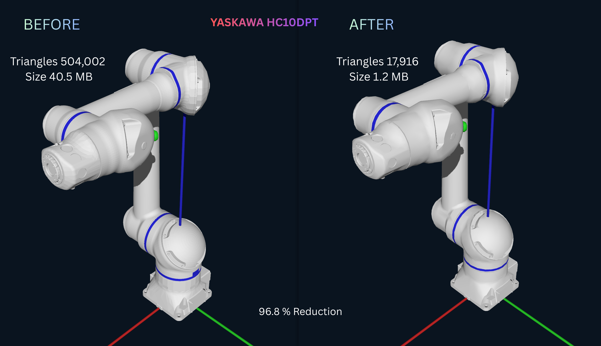

# Yaskawa HC10DTP-B00 URDF Optimization

This package contains an **optimized ROS robot description** for the
**HC10DTP-B00 industrial manipulator**.

The robot model was generated from the original **manufacturer CAD
model** and processed through a mesh optimization pipeline to produce
**lightweight meshes suitable for robotics simulation and motion
planning**.

---

# Robot Overview

| Property | Value |
|----------|------|
| Robot | HC10DTP-B00 |
| Degrees of Freedom | 6 |
| CAD Source | `HC10DTP-B00_range.stp` |
| CAD File Size | 14 MB |
| ROS Package | `hc10_description` |

---

# Mesh Optimization Results

The raw CAD meshes were extremely heavy and unsuitable for simulation.

They were optimized through:

- mesh cleanup
- polygon decimation
- visual/collision separation
- URDF restructuring

---

# Mesh Size Comparison

## Unoptimized Meshes (CAD Export)

| Link | File | Size |
|------|------|------|
| Base | `base_link_1.dae` | 1.6 MB |
| Link 1 | `link_1_1.dae` | 6.4 MB |
| Link 2 | `link_2_1.dae` | 8.9 MB |
| Link 3 | `link_3_1.dae` | 3.5 MB |
| Link 4 | `link_4_1.dae` | 11 MB |
| Link 5 | `link_5_1.dae` | 7.4 MB |
| Link 6 | `link_6_1.dae` | 1.7 KB |

Total mesh size ≈ **40.5 MB**

---

## Optimized Visual Meshes

| Link | File | Size |
|------|------|------|
| Base | `base_link_visual.dae` | 220 KB |
| Link 1 | `link_1_visual.dae` | 140 KB |
| Link 2 | `link_2_visual.dae` | 108 KB |
| Link 3 | `link_3_visual.dae` | 164 KB |
| Link 4 | `link_4_visual.dae` | 148 KB |
| Link 5 | `link_5_visual.dae` | 132 KB |
| Link 6 | `link_6_visual.dae` | 256 KB |

Total ≈ **1.19 MB**

---

## Collision Meshes

| Link | File | Size |
|------|------|------|
| Base | `base_link_collision.stl` | 4 KB |
| Link 1 | `link_1_collision.stl` | 12 KB |
| Link 2 | `link_2_collision.stl` | 20 KB |
| Link 3 | `link_3_collision.stl` | 4 KB |
| Link 4 | `link_4_collision.stl` | 16 KB |
| Link 5 | `link_5_collision.stl` | 28 KB |
| Link 6 | `link_6_collision.stl` | 8 KB |

Total ≈ **92 KB**

---
## Optimization Metrics

|Mesh Type                       |Unoptimized  | Optimized   | Reduction
|------------------------------- |------------- |------------ |-----------|
|Visual Mesh Triangles           |504,002       |16,192      | \~96.79%|
|Collision Mesh Triangles      |504,002       |1,724       | \~99.66%|
|**Total Optimized Triangles**   |504,002       |**17916** |  \~98.22%|

- The mesh optimization reduced **visual mesh complexity by \~96.79%** and **collision mesh complexity by \~99.66%**, significantly improving performance for robotics simulation and motion planning

# Optimization Summary

| Stage | Size |
|------|------|
| Original CAD | 14 MB |
| Raw Mesh Export | ~40.5 MB |
| Final Robot Model (Visual + Collision) | **~1.28 MB** |
| **Reduction** | **~96.8% smaller** |

This results in **over 96.8% reduction in mesh size compared to the raw Mesh export**, making the robot model suitable for:
- real-time visualization
- motion planning
- simulation

---

# Applications

The optimized robot model can be used for:

- robot visualization
- motion planning
- MoveIt integration
- Gazebo simulation
- Isaac Sim simulation
- robotics research

---

# Notes

The CAD model belongs to **Yaskawa Electric Corporation**.

This repository only contains **processed meshes and URDF structures for research and educational purposes**.
